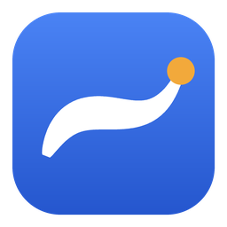

<p align="center">
  
</p>

<p align="center">
  <a href="https://github.com/YutoNiki/OpenPanet/stargazers"></a>
  <a href="https://github.com/YutoNiki/OpenPanet/network/members"></a>
  <a href="https://github.com/YutoNiki/OpenPanet/blob/master/LICENSE"></a>
</p>

# OpenPanet

<p align="center">
  <a href="https://github.com/YutoNiki/OpenPanet/releases/latest"></a>
  <a href="https://github.com/YutoNiki/OpenPanet/commits/master"></a>
  <a href="https://github.com/YutoNiki/OpenPanet/graphs/contributors"></a>
  <a href="https://github.com/YutoNiki/OpenPanet/releases"></a>
</p>

A free, open-source whiteboard app, started as a response to Microsoft Whiteboard's retirement. The name blends "Pane" (a window pane) with the sound of "paint".

`whiteboard.html` runs standalone — drag it into Edge/Chrome first to try it out.

See [CHANGELOG.md](CHANGELOG.md) for release notes.

## Installing on Windows

Grab the installer or the portable build from [Releases](https://github.com/YutoNiki/OpenPanet/releases/latest).

Alternatively, install straight from the command line via winget and the manifest in this repo (no submission to the winget-pkgs community repo needed). Local manifest installs are an opt-in winget feature, so the first line below only needs to be run once, as an administrator:

```powershell
winget settings --enable LocalManifestFiles
irm https://raw.githubusercontent.com/YutoNiki/OpenPanet/master/winget/OpenPanet.yaml -o OpenPanet.yaml
winget install --manifest OpenPanet.yaml
```

## Wacom tablet setup (important)

The browser/Electron only receives pen pressure and tilt via **Windows Ink**.

1. Open "Wacom Tablet Properties" → Pen → check **"Use Windows Ink"**
2. If unchecked, `PointerEvent.pressure` stays a constant 0.5 and strokes lose their pressure-based width
3. If the ripple effect on tap, or the long-press right-click menu, gets in the way, turn those visual effects off in Windows' "Pen & Windows Ink" settings or the Wacom Desktop Center

Already implemented in the app:

| Feature | Implementation |
|---|---|
| Pressure | `e.pressure` drives stroke width (width × (0.35 + 0.65 × pressure)) |
| Tracking | `pointerrawupdate` + `getCoalescedEvents()` also pick up points the browser would otherwise drop |
| Eraser via pen tail | `e.buttons & 32` is treated as the eraser |
| Auto pen switch | Touching with `e.pointerType === 'pen'` switches back to the pen tool (except while erasing, panning, or over a selected object) |
| Cursor | SVG cursor changes per tool (pen / eraser / grab); erasing with the pen tail still shows the eraser cursor |

## Shape auto-correction

Toggled by the button at the right end of the toolbar (**off by default**). When on, releasing the pen evaluates the stroke and replaces it only if it matches a **circle, rectangle, or regular polygon** (open strokes/straight lines, non-circular ellipses, and irregular polygons are left untouched).

How it decides:

1. Strokes with a bounding-box diagonal under 56px, or a path length under 0.8x that diagonal, are skipped (so handwriting isn't affected)
2. Strokes that aren't closed (start and end far apart) are skipped
3. For closed strokes, it compares the fit error of a polygon vs. a circle:
   - Polygon: tries 6 different RDP simplification thresholds, keeping the one with the fewest vertices whose error is under 2% of the diagonal. It's only accepted if it can be straightened into an axis-aligned rectangle (snapped to a square when close to one) or a true regular polygon — an irregular polygon that fits neither is left uncorrected
   - Circle: accepted only if the radial error against the best-fit ellipse is under 4.5% of the diagonal *and* the aspect ratio is close to 1 (0.87-1.15)
4. A regular polygon keeps the rotation it was drawn at

Full details live in `beautify()`. If it's over- or under-triggering, tune `diag < 56` (minimum size) and `polyTol = diag * 0.02` (polygon error tolerance).

### Switching to "pause, then release, to correct"

The OneNote-style timing produces fewer false positives. Record `lastMoveAt = performance.now()` at the end of `handleMove`, then change the correction condition in `endPointer` to `shapeAssist && performance.now() - lastMoveAt > 350`.

## Canvas controls

| Action | Binding |
|---|---|
| Wheel | Zoom, centered on the cursor (10% steps) |
| Shift + wheel | Scroll |
| Space + drag / middle-button drag | Pan |
| Right-drag (a pen's barrel button works too) | Lasso-select a freeform area; selects everything it touches and switches to the select tool |
| Ctrl+0 | Reset zoom to 100% |
| Touch guard | `touch-action: none`; touch is only used for panning |

## Selecting and moving multiple objects

Right-drag a freeform loop to lasso-select every stroke or image it touches. The select tool activates automatically, and dragging from inside the selection moves every selected object together, preserving their relative positions. Clicking outside the selection clears it. Delete/Backspace removes the whole group.

## Icon

The bundled icon depicts a single ink stroke whose width varies with pressure.

| File | Use |
|---|---|
| `icon.svg` | Source. Already embedded as a data URI favicon in `whiteboard.html` |
| `icon.ico` | Windows executable/window icon (bundles 16-256px) |
| `icon-256.png`, etc. | Store listings and shortcuts |

To use it for the Electron window/taskbar, add it to `main.js`'s `BrowserWindow`:

```js
const win = new BrowserWindow({
  icon: path.join(__dirname, 'icon.ico'),
  // ...
});
```

To embed it in the built .exe via electron-builder, add this to `package.json`:

```json
"build": { "win": { "icon": "icon.ico" } }
```

## Building a Windows executable

This repo is a complete Electron project. On Windows:

```
npm install
npm run dist
```

produces an installer and a portable exe in `dist`. See `BUILD.md` for details.

> **Note:** release builds aren't code-signed, so Windows SmartScreen will show "Windows protected your PC" the first time you run one. Click "More info" -> "Run anyway" to continue — this is expected for an unsigned open-source build.

Project layout:

| File | Role |
|---|---|
| `main.js` | Creates the window, fetches image URLs on the main process to avoid tainting the canvas with CORS, and picks the UI language |
| `preload.js` | Exposes only `window.api.fetchImage` and the detected UI language to the renderer |
| `whiteboard.html` | The app itself — also runs standalone in a browser |
| `package.json` | Includes the electron-builder build configuration |

## Language

The installer lets you pick English or Japanese; the app's UI follows that choice. Outside the installer (portable build, or the HTML file opened directly in a browser) it falls back to the OS/browser language, defaulting to English. See `whiteboard.html`'s `STRINGS` object and `main.js`'s language detection for details.

## Drag-and-drop from a browser

Dragging an image out of Chrome often hands you a **URL**, not the actual file. This app reads the `` from the `text/html` drag data, but if the source site doesn't allow CORS, the canvas becomes tainted and PNG export stops working (the app shows a warning when this happens).

Electron avoids this by fetching the image on the main process and returning a data URL:

```js
// main.js
const { ipcMain, net } = require('electron');
ipcMain.handle('fetch-image', async (_e, url) => {
  const res = await net.fetch(url);
  const buf = Buffer.from(await res.arrayBuffer());
  return `data:${res.headers.get('content-type')};base64,${buf.toString('base64')}`;
});
```

Expose it from preload with `contextBridge.exposeInMainWorld('api', { fetchImage: url => ipcRenderer.invoke('fetch-image', url) })`, and have `loadURL()` try `window.api?.fetchImage(url)` first.

## Possible next steps

- Page/board switching, saving and restoring a board (serialize `items` to JSON; images as data URLs)
- Shape tools (rectangle, circle, arrow), text boxes
- A laser pointer (a trail that fades after a moment) — useful for pointing things out during screen sharing
- Real-time collaborative editing with multiple people (e.g. Yjs + WebSocket)
